Praktikum 1
[Gambar Praktikum 1 (pembuatan project)](image-1.png)
Pertama melakukan pembuatan project, dengan menekan "ctrl+shift+p" pada keyboard, lalu akan ditujukan untuk pembuatan folder untuk project flutter
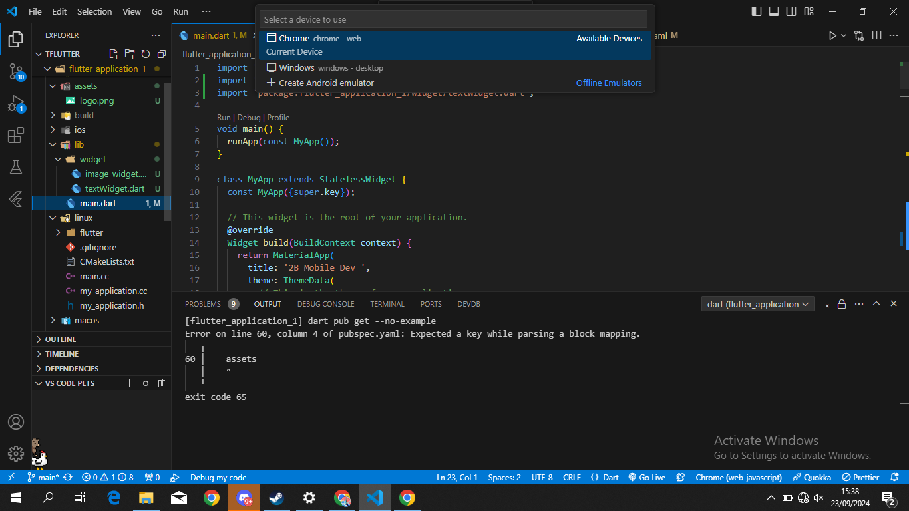
setelah flutter sudah berhasil dilakukan, menekan F5 untuk preview dari flutter yang dibuat seperti gambar "Preview"
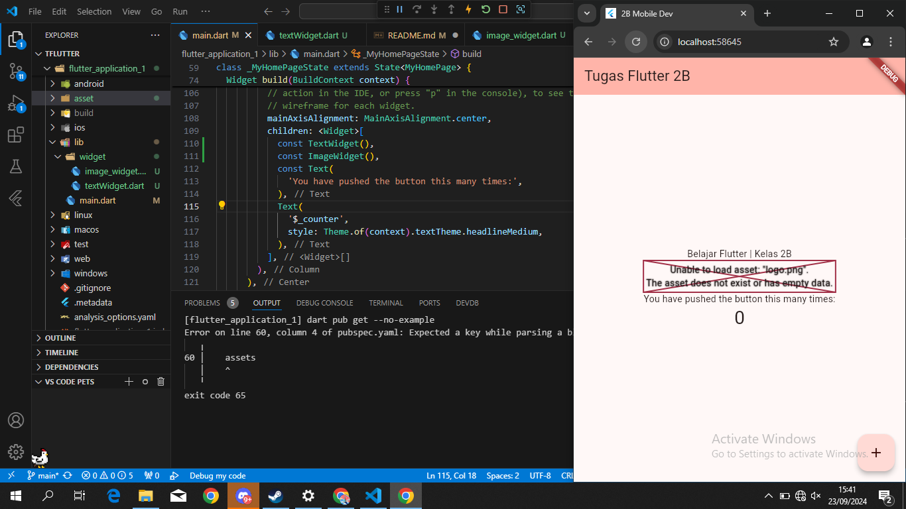
kurang lebih tampilannya akan seperti gambar image 5 diatas setelah melakukan preview menggunakan chrome

Praktikum 2
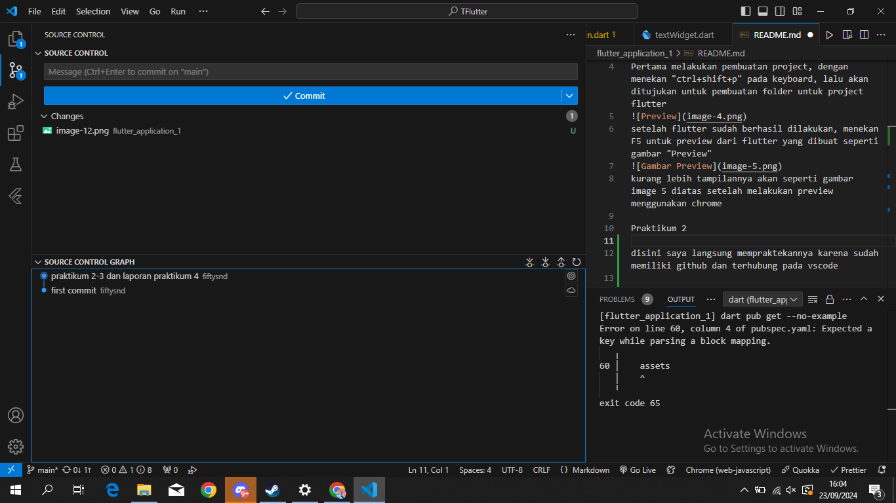
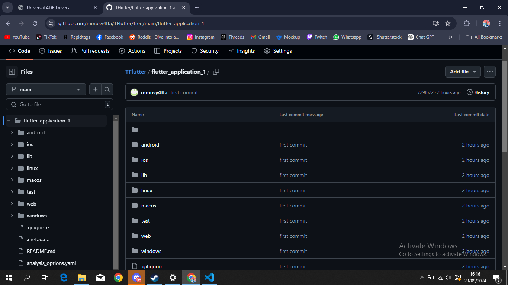
disini saya langsung mempraktekannya karena sudah memiliki github dan terhubung pada vscode

Praktikum 3
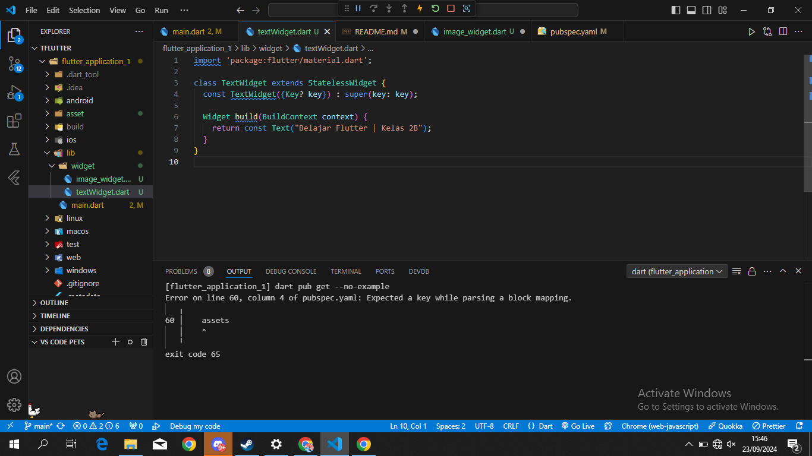
lalu mengubah tulisan pada "body" sesuai kebutuhan, dengan menambahkan folder dalam "widget" pada folder "lib" dan menambahkan file "text_widget" dan code-nya sama seperti digambar image-6
dan tambahkan dalam file "main" seperti gambar ini
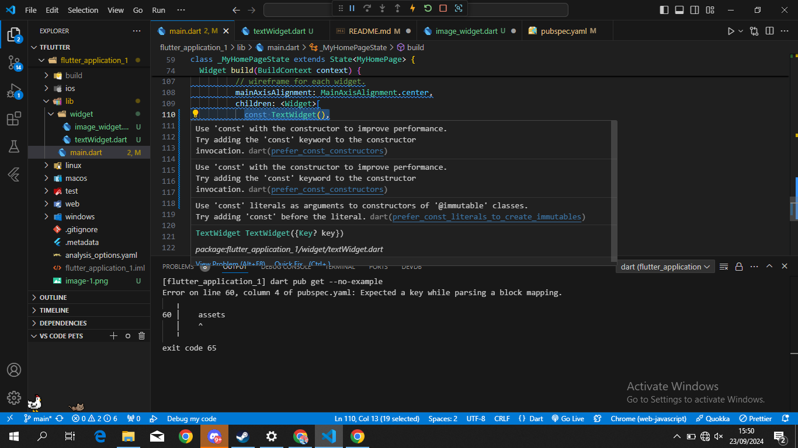
hasilnya seperti ini 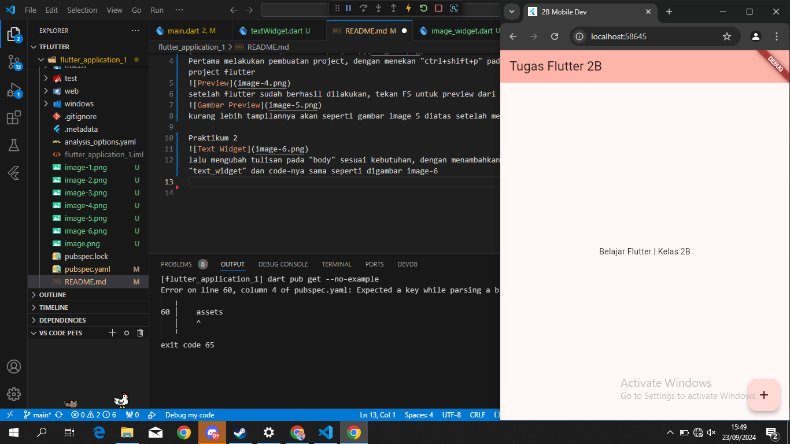

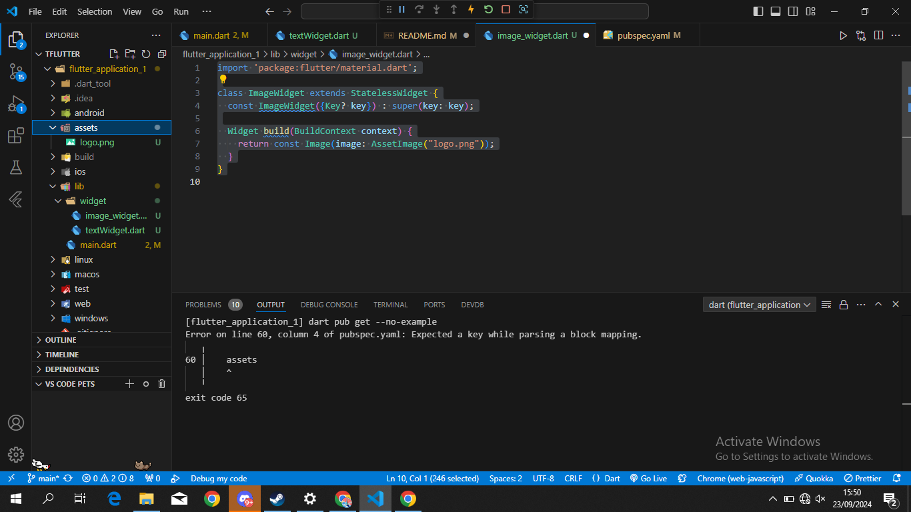
membbuat file pada widget seperti sebelumnya, namun mengganti nama dengan ImageWidget, lalu mengisi file tersebut dengan code seperti gambar
setelah itu membuat folder assets dan memberi logo/gambar
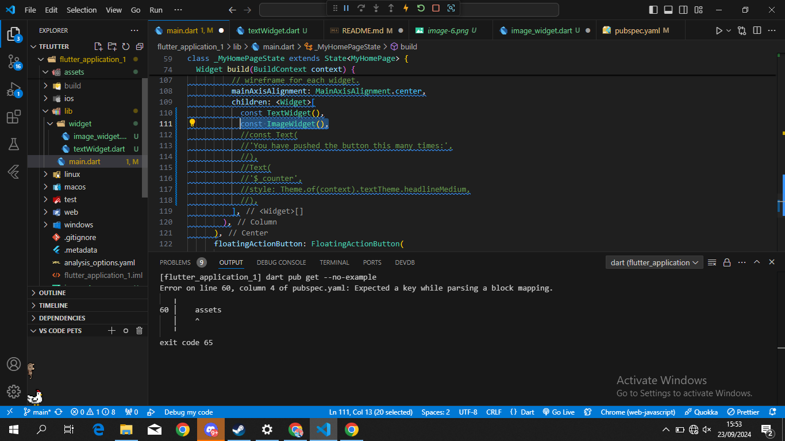
dan manambah const ImageWidget seperti sebelumnya
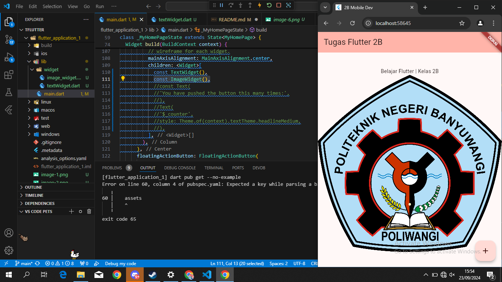
jika berhasil tampilan akan seperti gambar diatas

Praktikum 4
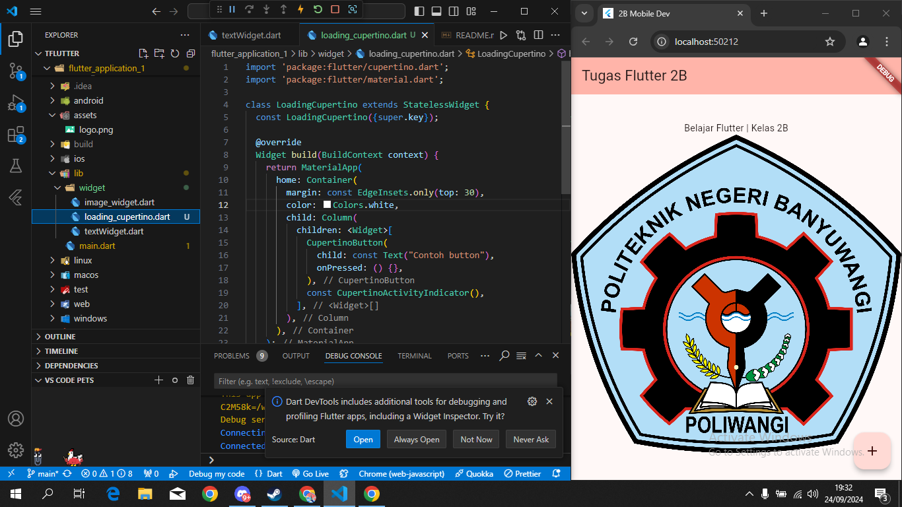
langkah selanjutnya membuat cupertino button dan loading bar, lalu menggunakan code seperti gambar.
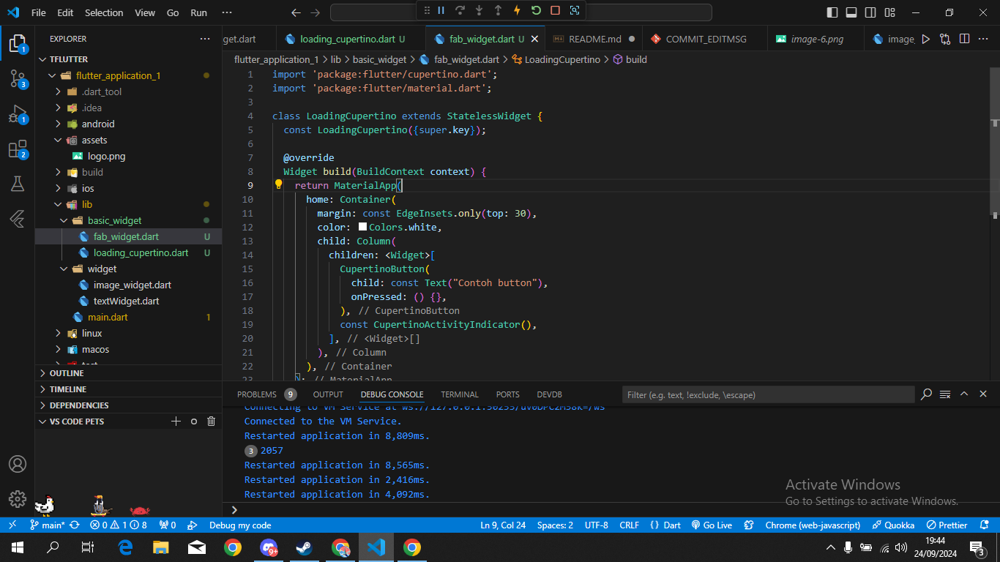
setelah itu menambahkan file fab_widget, dan menambahkan code dalam file lalu memasukan beberapa code di file "main.dart"
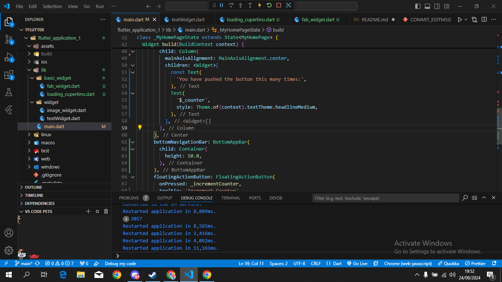
dan mengganti code "headline4" menjadi "headlineMedium"
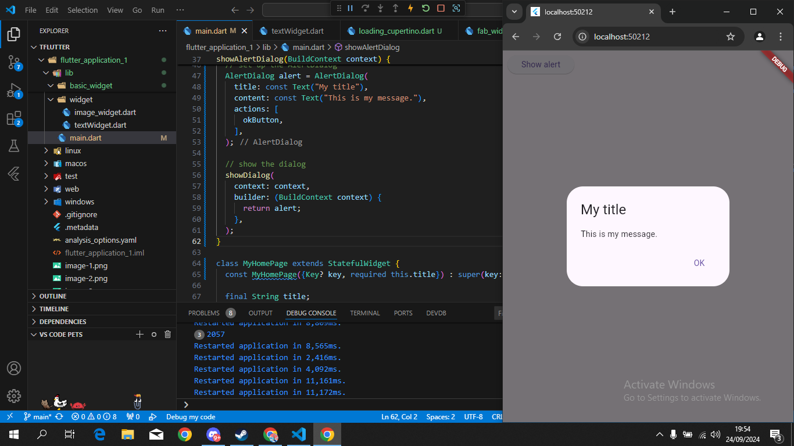
mengubah class Stateless Widget seperti gambar
lalu menambahkan code di file "main.dart" dan menghapus file widget build sebelumnya, karena akan terjadi tabrakan jika tidak dihapus/komen 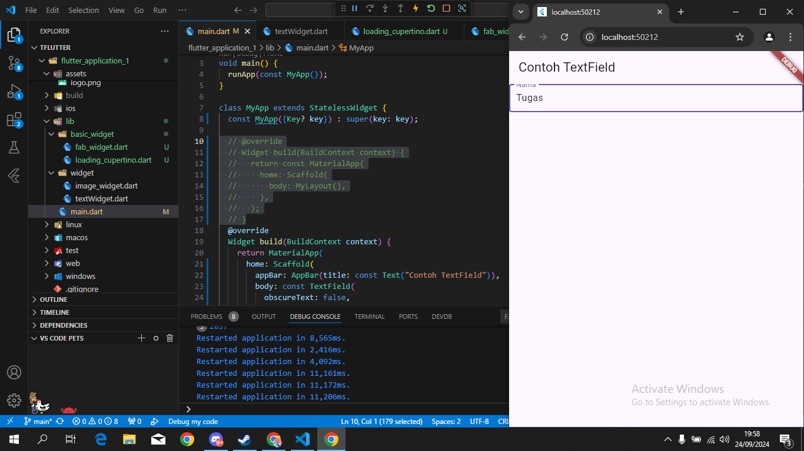
langkah yang terakhir mengubah/mengganti seluruh file "main" dan menambahkan copy code seperti gambar
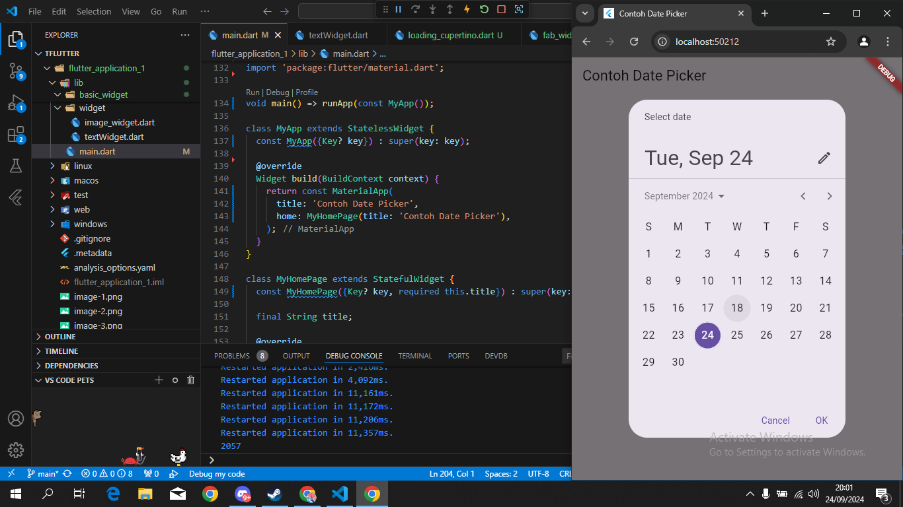
